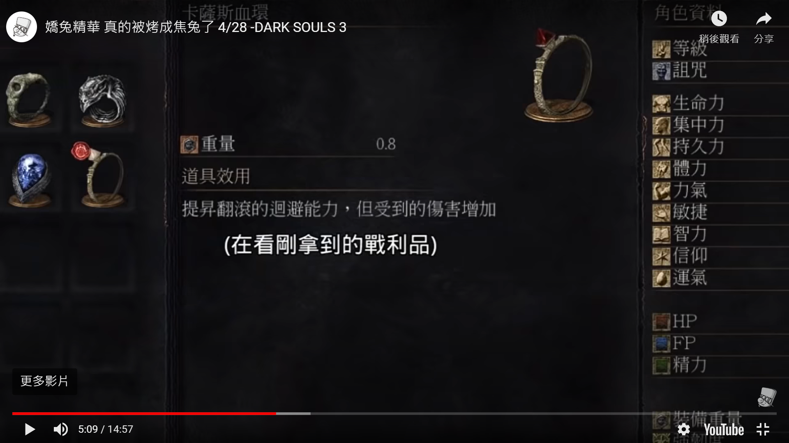
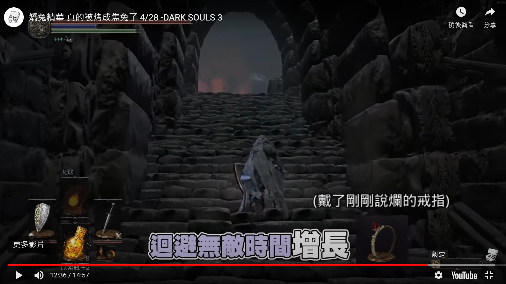

Thank you for your interest in Project SETH and reading this devlog. 
In this single post, I will give a brief introduction of what Project SETH is and also most importantly, 
the status quo of Project SETH.

# What is Project SETH?

Project SETH is an independent research project started when I was a member of the undergraduate game related technology research
team at University of Michigan instructed by Professor Austin Yarger in early 2020.

The goal of Project SETH is to build a tool that can automatically extract/locate highlights from video game stream recording (actually not limited to video game stream, which I will explain later).
Project SETH is going to help streamers on platforms like Twitch, Facebook Live, YouTube Live, Douyu, and streaming related video content creators (e.g. derivative work or else) on YouTube or Bilibili.

The algorithm behind Project SETH is about "crowd-sourcing", which is very different from most video game stream highlight tools on the market (actually different from all of them as far as I know). Those video game stream highlight tools utilize computer vision and machine learning to extract and analyze the "content" of the video game stream and then decide when does a highlight occur. On the other hand, instead of analyzing the "content" of the video game stream, Project SETH analyzes the "reaction" of the crowd, and the crowd includes audience as well as the streamer. Since all the information needed for my algorithm are collected from the crowd, so it is called "crowd-sourcing".

One importrant benefit of Project SETH using my crowd-sourcing algorithm to detect stream highlights is that "audience reaction" is much more consistent with different genres of video game streams, even non-video-game streams(e.g. cooking stream), while the "stream content" varies a lot, and so Project SETH is a much more general and versatile solution to extracting highlights of all kinds of stream, on the other hand, for those highlight extraction tools that rely on analyzing the "stream content", for every new video game or new genre of streaming, they are likely to have to train a new model.

# Current Status of Project SETH

Up to now, Project SETH has shown high effectiveness in extracting highlights from stream. 
Here is a video list of demo and test case results along different stage of development:

[https://www.youtube.com/playlist?list=PLR1OVOGFjHaBxU3M8fACFNOFhgV-LpBi0](https://www.youtube.com/playlist?list=PLR1OVOGFjHaBxU3M8fACFNOFhgV-LpBi0)

However, Project SETH has not reached its perfect from yet. Right now, as far as I have discovered,  there are scenarios that may cause mistakes in Project SETH's highlight extraction, either neglecting a highlight or mis-captured a non-highlight.

## Issue 1 : non-highlights that can be mis-captured (false positive)

Since the crowd-sourcing algorithm behind Project SETH is about analyzing streamers' and audience's reaction, non-highlight events that cause fluctuation in chat room are likely to be mis-captured.

One example of such an event is "give-away time", which is when a streamer pick a random audience from the pool and give away stuff(e.g. gift code, gaming devices, merchandise, etc). During "give-away time", in order to join the pool, viewers are often required to type some command in the chat room (e.g. !join, !giveaway, +1, etc).

Another example is "question time", which is when streamer ask audience a question and cause lots of audience to type in chat room to answer. Sometimes, "question time" is a legit highlight if the question or the answer itself is "hyped" enough. However, in scenario that a streamer start playing a new video game and ask some basic questions about it, it should be a non-highlight.

"give-away time" and "question time" both can be non-highlight while causing fluctuation in chat room and will be mis-captured.

## Issue 2 : highlights that can be neglected (false negative)

Since the crowd-sourcing algorithm behind Project SETH is about analyzing streamers' and audience's reaction, what if there is such an highlihgt that audience may not notice on the spot (or may only partialy notice)? I called this kind of highlight as a "context highlight" because it rely on context to become a highlight, and the highlight moment itself alone does not mean much. This may sound obscure, so here I pull out a study case as an example.

The study case is from a Taiwanese streamer [zrush](https://www.twitch.tv/zrush) playing _Dark Souls 3_.  
There is a moment when he got a new equipment, which is a ring that can increase user's invincibile time while dodging but user will be more vulnerable and take more damage in exchange. When zrush first got that ring, he said that equipemnt was trash and there is no chance he will use it.

_zrush said this ring is trash and he will never use this ring_

However, later when zrush struggled fighting a boss because he could not deal with a specific boss's ability, he found this ring helpful and use it.

_zrush later put on that ring_

In this case, _"zrush later put on that ring"_ is a typical "context highlight" because without _"zrush said this ring is trash and he will never use this ring"_ as a context, it will not be thought of as a highlight, and both sections should be captured together for this highlight to be legit. However, audience will only react in chat room when _"zrush later put on that ring"_ happens and the context _"zrush said this ring is trash and he will never use this ring"_ will be ignored and not captured by Project SETH.

"context highlight" is the kind of highlight that may be neglected or incompletely captured by current state of Project SETH.

